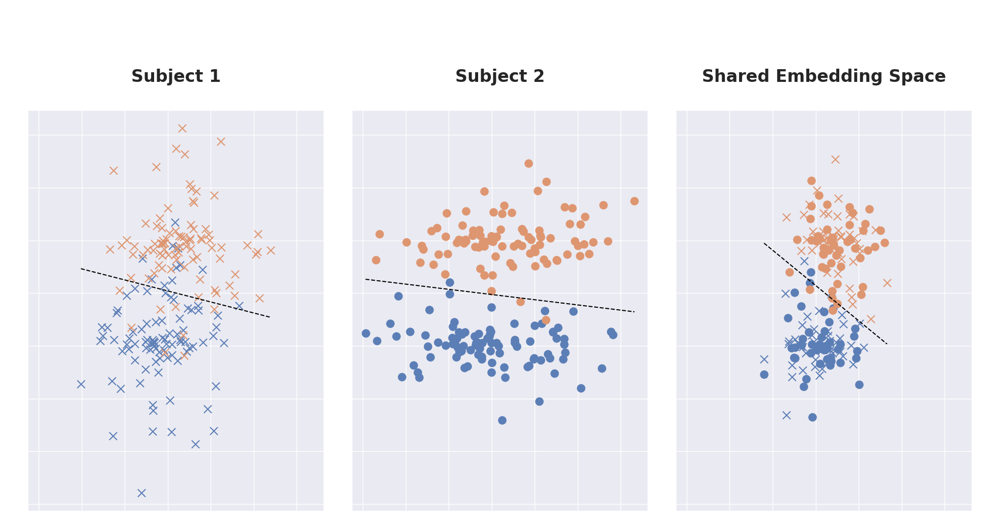
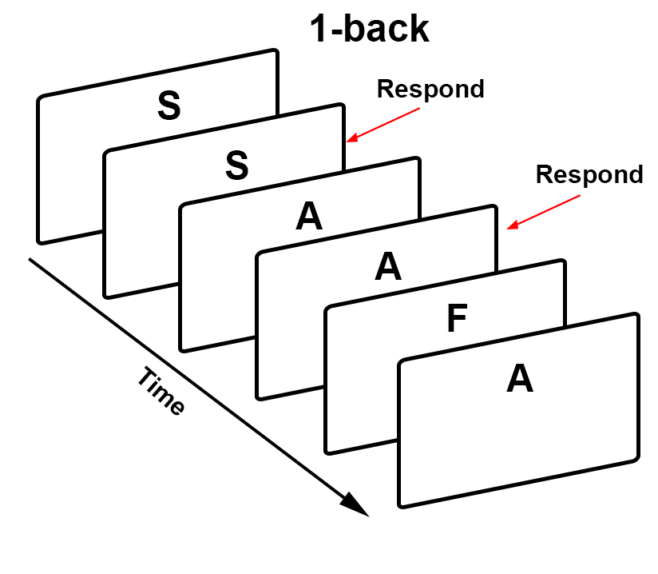
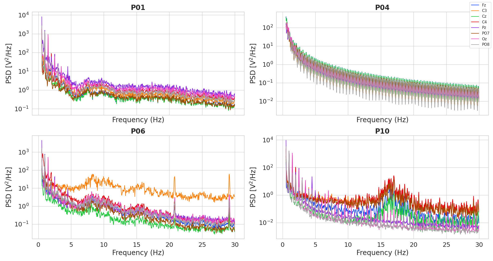
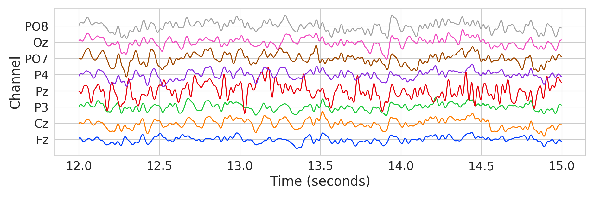
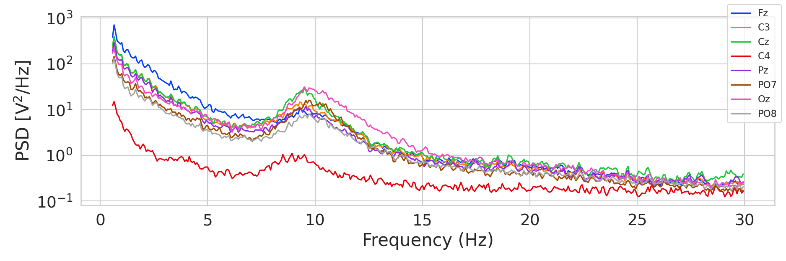
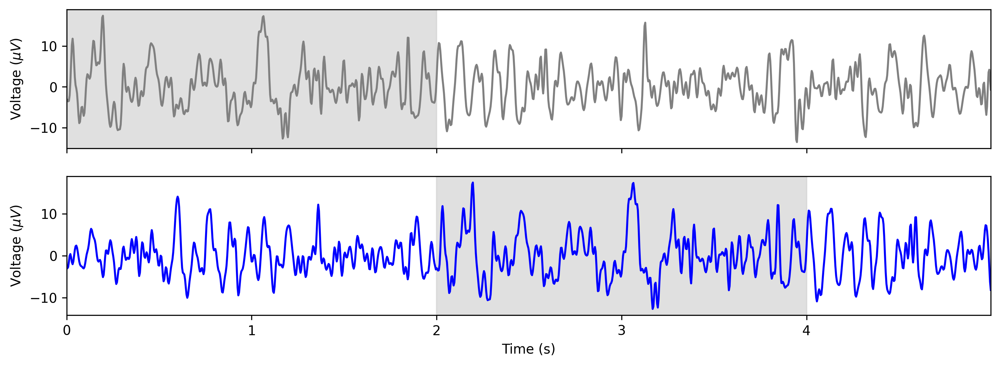
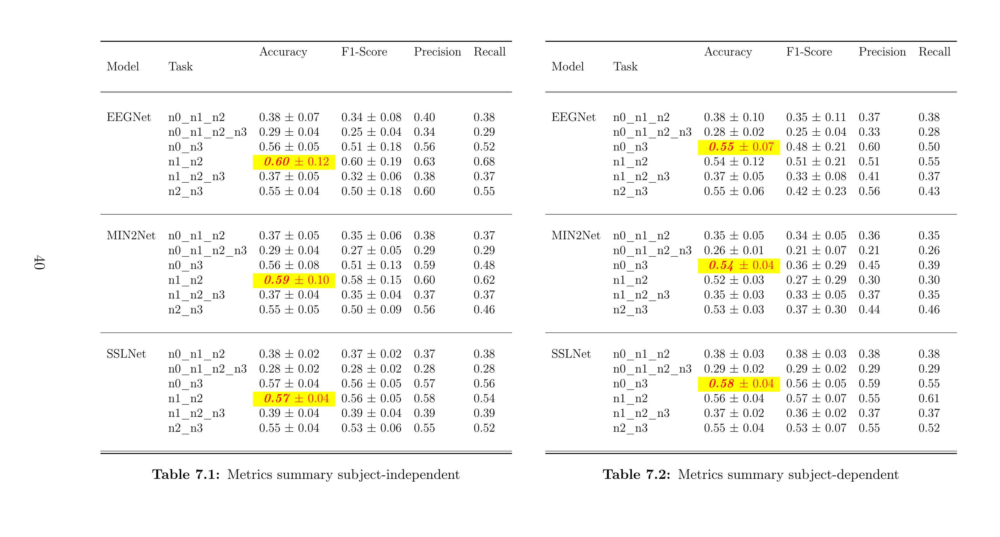
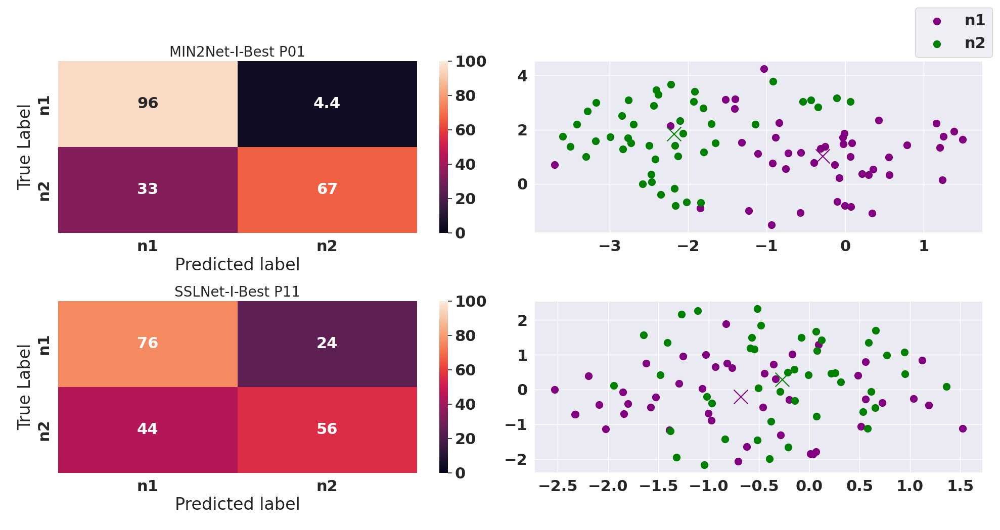
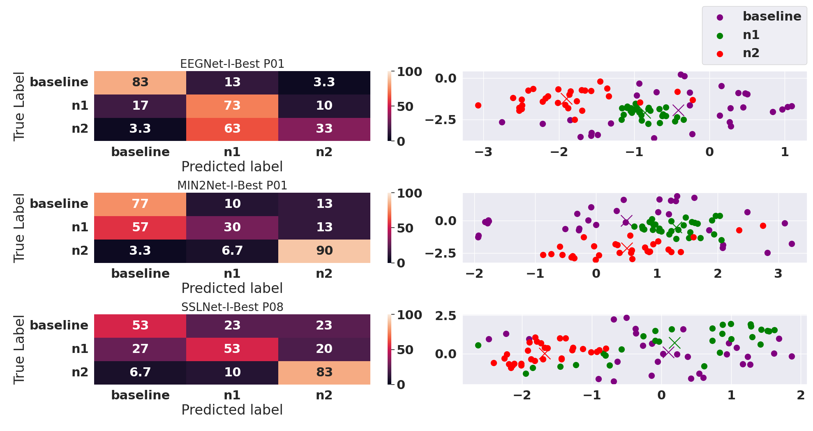

# Person and Session Invariant Representation of EEG Signals via Deep Learning
#### Master Thesis 2023 (University of Bremen)
##### By Mohammed Hussam Al Turjman. Supervisor Dr. Felix Putze

## Overview
In addressing the subject variability problem of 
EEG signals, the work at hand investigates two 
different approaches using deep learning methods. 
While the first is based on multi-task learning with
the employment of deep metric learning and an autoencoder [[1](https://pubmed.ncbi.nlm.nih.gov/34932469/)], 
the second utilizes a contrastive learning framework [[2](https://arxiv.org/abs/2007.04871)] using
several augmentation techniques. Both approaches aim at 
minimizing subject-specific content. 
For the purpose of evaluating those approaches, 
an experiment was conducted to collect EEG signals 
from participants, while they solve the so called N-Back 
game. The studied approaches are evaluated mainly for their 
ability to generalize across data of unseen subjects. 
Moreover, the approaches are assessed for their ability to 
learn invariant representation of EEG signals regardless of 
the classification task.
### Problem Statement
One prominent technique to deal with EEG signals is to learn new features, that can be
used by downstream tasks .i.e classification. The resulting features belong to a latent
feature space, that varies extremely from one subject to the other. Thus, leading to
different joint probability distributions. Another challenge that hinder classifying EEG
signals is the kind of tasks to be classified. For instance, if the purpose of classification is
to recognize physical activities such as (left vs right) hand movement is generally more
straightforward compared to discerning what a person is currently thinking or imagining.
In order to address this problem, a common feature space must be found to improve the
overall performance of the downstream task. An important aspect of ensuring a common
embedding space is to enforce the feature-extractor to minimize the subject-specific content.
This way, the learned features contain only shared information among all subjects. Figure
1.1 depicts an arbitrary embedding spaces of two subjects and a common feature space.

Each color denote a class label to be classified and the different feature shapes are to show
that each subject has their own specific features. The last plot to the right is an example
of how different embedding spaces can be joined together, by finding new features that are
common among many subjects. In the work at hand, the goal is to address the challenge of classifying working memory load. Specifically, the objective is to find a generalizable
solution for categorizing the cognitive challenges that arise when a person is presented
with a set of tasks varying in difficulty. These challenges stimulate functions like thinking
and remembering.

## N-Back Game
In the purpose of empirically studying the previously introduced approaches, an experiment
was conducted to acquire EEG data from participants while they solve the n-back game.
This game is a widely used cognitive task and assessment tool in the field of psychology and
neuroscience. It is designed to measure the working memory capacity and assess the ability
to maintain and manipulate information in the short-term memory. The participants
are presented with a sequence of rapidly flashing letters displayed at the center of the
screen. The primary objective of this cognitive challenge is to discern whether the presently
displayed letter matches the one presented at a specific distance of n steps back within
the sequence. For instance, in the context of a 2-back game, participants are required to
determine if the current letter matches the one that appeared two positions earlier in the
sequence. The n-back game’s level of difficulty can be modified by adjusting the value
of n, with higher values posing progressively greater challenges for participants, thereby
placing increased demands on their working memory capacity. The following figure illustrates the 1-back game.

[Image source](https://andysbrainbook.readthedocs.io/en/stable/ASL/fASL_03_Task.html) 

## Recording Quality
After inspecting the EEG data of each subject individually using PSD analysis, it has become evident that not all of the recorded data are suitable for
use. Specifically, subjects P 04, P 06 and P 10 show abnormal distribution of frequencies
across the whole session. Figure 1.2 illustrates the filtered frequencies within the range
of [0.5, 30] Hz for the previously mentioned subjects in addition to subject P 01, whose
data demonstrate expected and normal frequency distribution. A more detailed inspection
of the data of subject P 04 reveals the presence of exceptionally rapid oscillations across
all channels. Furthermore, subject P 10 shows disturbance, shift in one channel and
unexpected spikes. Similarly, subject P 06 shows extreme shift in channel F z and sudden
spikes. On the other hand, subject P 01 shows relaxed signals across all channels with no
sudden spikes.

## Data Preprocessing
Typically, prior to commencing model training, it is customary to subject the input data
to a series of pre-processing stages. In certain instances, the process may necessitate the
inclusion of feature engineering techniques to ensure the data assumes an appropriate
format. However, in this work the EEG data were neither subjected to feature engineering
nor to artifact removals. The reason for this decision, is the fact, that is unclear, how much
information could be lost by applying such techniques.
In this work only four stages of pre-processing are
performed, namely resampling, scaling, normalization and frequency filtering.
### Time-domain
To get an idea of the EEG signals obtained during the N-Back experiment, figure 1.4 shows
a three seconds snippet over all channels from the data of subject P01.

### Resampling
In order to reduce the dimensionality of the data, it is necessary to perform down-sampling
of the original frequency. This is done by keeping every other N points from the original
time domain signals. Unless, otherwise specified the data were down-sampled to 124 Hz.
### Scaling
Since a deep learning model is sensitive to the values of the input data, it is necessary to
bring the values of each subject into a shared range. Scaling involves the transformation
of EEG signal amplitudes to a standardized range. There are several types of scaling
methods, among them is the so called “standard scaler”, which is used in this work.
### Normalization
Another step of preparing the data is normalization using the L2 norm.
### Frequency Filtering
The gathered data contain frequencies between 0 and 120 Hz. Not all of these frequencies
are of important in the context of EEG signals classification. Therefore, it is necessary
to filter out certain frequencies. In this study, both high and low - pass filters were used.
the most commonly used frequency bands for classifying EEG signals are:
delta (0.5 to 4Hz); theta (4 to 7Hz); alpha (8 to 12Hz); sigma (12 to 16Hz) and beta (13
to 30Hz). Base on that, the collected data were filtered in the range [0.5, 30] Hz.

## Data Augmentation
In order to realize and implement the contrastive framework,
several augmentations have been implemented.
### Temporal Cutout
Temporal cutout means randomly removing contiguous segments of the EEG signals over
all channels. This is done by assigning zeros to the selected segments.
### Temporal Delay
Temporal delay or sometimes called time reverse transformation is an augmentation, that aims at shifting an EEG signal over the time axis.
In the work at hand, this method is implemented by randomly selecting a time
window value n ∈ [start, end], where start and end are predefined values determining the
minimum and maximum shift range in seconds.

### Gaussian Noise
In this transformation an independent and identically distributed Gaussian noise is added
to a masked region of the signal over all channels.
### Bandstop Filtering
The purpose of this augmentation is to filter out a randomly selected frequency band.
### Sensor Transformations
For the purpose of simulating channels with low amplitudes, sensor dropout introduced to replace a subset of channels with zeros.

## Training
The essential components such as the model, optimizer and loss
functions are initialized and the dataset is divided into batches within a dataloader, which
is used by a trainer module. The later takes control of those components and monitors
the training process by saving important information such as, the progress of the loss
function and the validation accuracy.
## Results
The results obtained in this thesis serve to provide a comprehensive evaluation, comprising
both summative and formative assessments of the different approaches investigated.
The
summative assessment, presented in the following tables, offers an overview of the overall
performance and the key findings extracted from the studied methodologies.

### Analysis
To conduct an in-depth examination of the results, an exploration of the embeddings and
confusion matrices are presented in the following figures.

## Feedback
If you have any feedback or questions, please feel free to contact me. I 
would appreciate also citing this repository if you use any of the code or information provided here.
